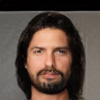
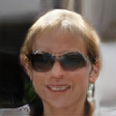
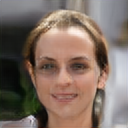
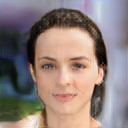
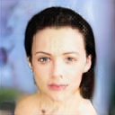
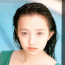

# Pioneer Networks


...



...


...




...


Figure: For two real input images (far left and far right), our model can e.g. morph one to the other. The images in between are synthesized (More intermediate images [here](https://github.com/AaltoVision/pioneer/tree/master/samples)).

## Non-technical Summary

PIONEER is a generative neural network model that learns how certain kinds of images, such as faces, are structured.
It can be used to modify your input images in various smart ways (e.g. make the nose bigger, more feminine, etc.) without losing sharpness in the output. The best-known generative models, GANs, cannot normally make this kind of general modifications of *existing input images*.

## Abstract

We introduce a novel generative autoencoder network model that learns to encode and reconstruct images with high quality and resolution, and supports smooth random sampling from the latent space of the encoder. Generative adversarial networks (GANs) are known for their ability to simulate random high-quality images, but they cannot reconstruct existing images. Previous works have attempted to extend GANs to support such inference but, so far, have not delivered satisfactory high-quality results. Instead, we propose the Progressively Growing Generative Autoencoder (PIONEER) network which achieves high-quality reconstruction with 128x128 images without requiring a GAN discriminator. We merge recent techniques for progressively building up the parts of the network with the recently introduced adversarial encoder-generator network. The ability to reconstruct input images is crucial in many real-world applications, and allows for precise intelligent manipulation of existing images. We show promising results in image synthesis and inference, with state-of-the-art results in CelebA inference tasks.

## Materials

[Paper pre-print](https://arxiv.org/abs/1807.03026)

[Code (PyTorch)](https://github.com/AaltoVision/pioneer)

[Pre-trained models](https://zenodo.org/record/1455188)

## Support

For all correspondence, please contact ari.heljakka@aalto.fi.

## Referencing

Please cite our work as follows:

```
@inproceedings{Heljakka+Solin+Kannala:2018,
      title = {Pioneer Networks: Progressively Growing Generative Autoencoder},
     author = {Heljakka,Ari and Solin, Arno
               and Kannala, Juho},
       year = {2018},
  booktitle = {Asian Conference on Computer Vision (ACCV)}
}
```
